# 2.1信息存储
## 2.1.1十六进制表示
1.一个字节由8位组成。
2.十六进制，二进制，十进制之间关系
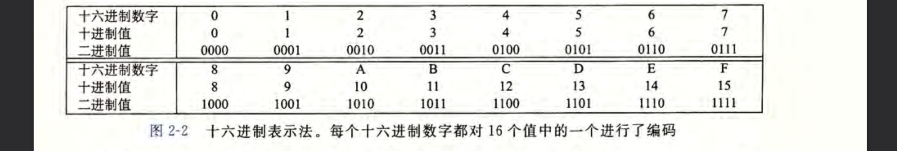
3

## 2.1.2字数据大小

# 2.2整数表示
## 2.21 整数类型
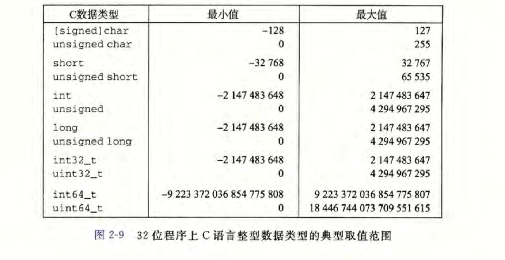
无符号数>=0
注：取值范围不对称（与后面补码表示方式和计算有关）
## 2.22-2.25 有无符号数的编码
1.
（tips:
T（int)：表示有符号数
U(Unsigned int)：表示无符号数
B：表示二进制)
### 二进制转化成无符号整数：
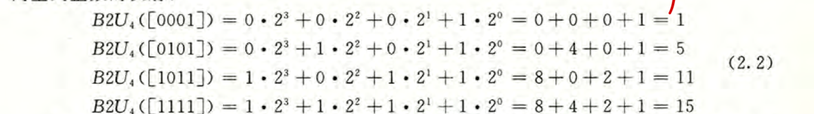
B2U是一个函数，转化二进制（无符号编码）成无符号整数
### 二进制转化成有符号整数：
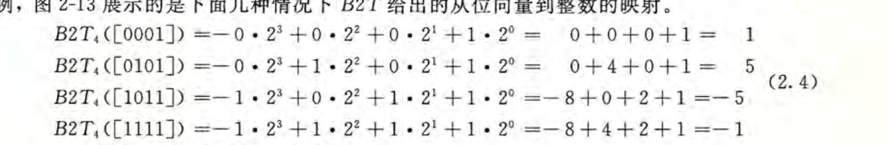
B2T是一个函数，转化二进制（补码编码）成有符号整数

唯一性：一个二进制编码对应一个有符号整数或无符号整数
2.

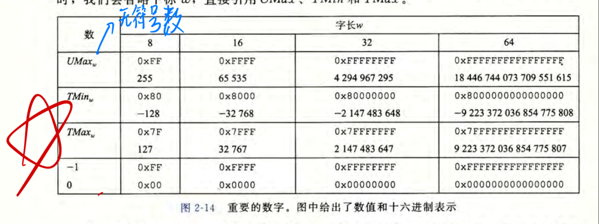
UMax表示无符号数最大值
TMax表示有符号数最大值
注：-1和UMax有同样二进制位
3.
### 有符号数和无符号数相互转换

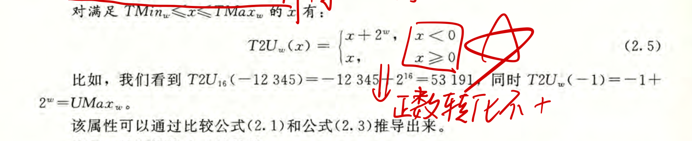
有符号数转化无符号数（结果是无符号数）

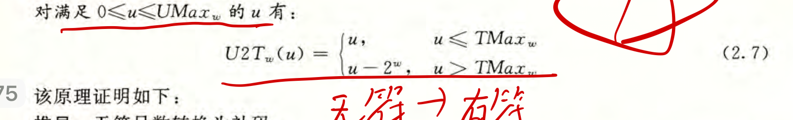
无符号数转化成有符号数
本质：二进制表示形式不变，解释位的形式（计算符号位方式）改变了

4
### c语言有符号数和无符号数的比较
原理
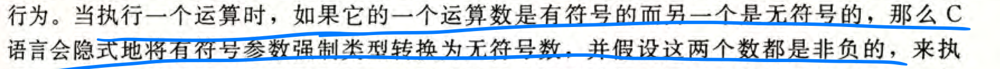
例题：
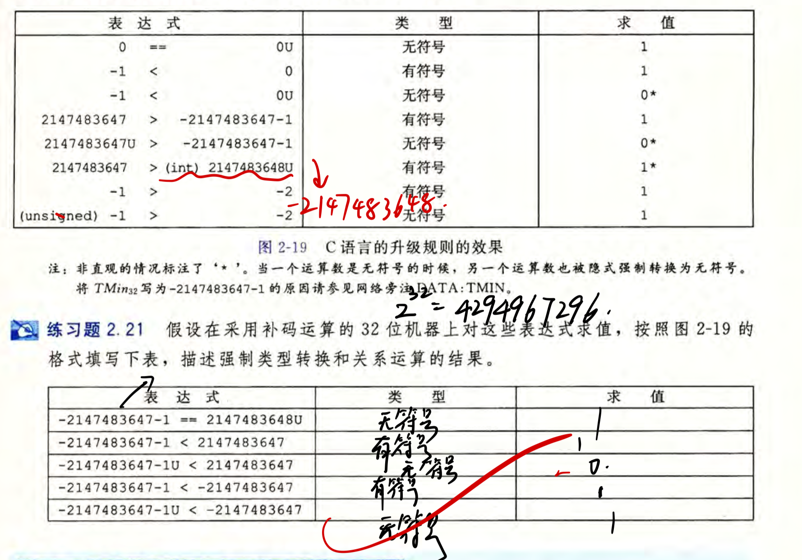
U后缀：这个数是无符号数

## 2.26到2.27 不同大小数据类型转化（不同二进制位的转化）
### 扩展（小转大）：
无符号数：二进制开头加0。
原理：零扩展

有符号数：
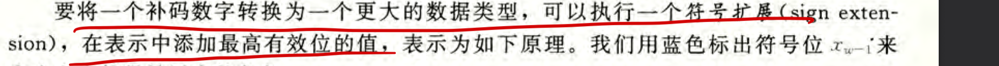
原理：符号扩展
比如二进制位【101】转化成【1101】，【011】转化成【0011】

### 截断（大转小）
w位转化成k位（w>=k）
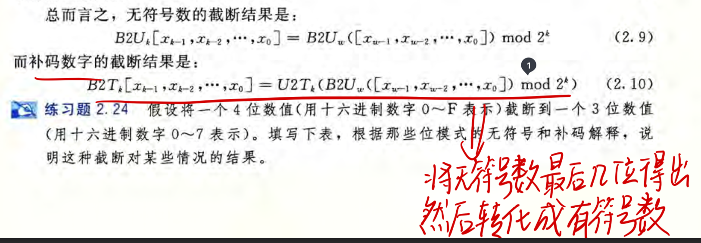
B2T理解成先进行无符号数的截断转化成无符号数，然后无符号数转化成有符号数
对比理解：
十进制数111100（w=6）转化1100（k=4）
111100%10000(10^4)=1100
练习：
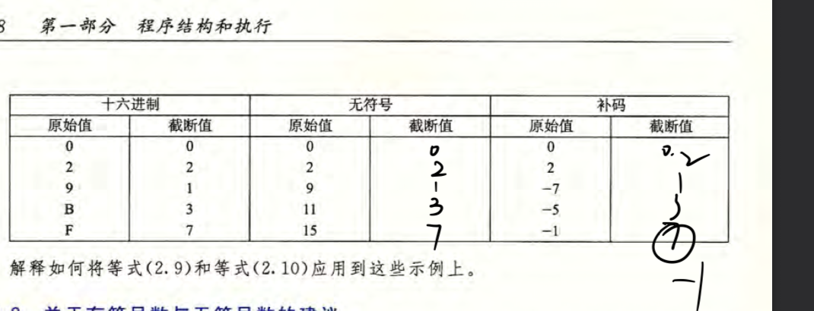
错题：
在补码计算出无符号数7的时候，要转化成有符号数，先比较
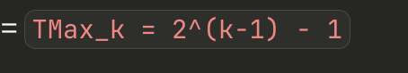
7和TMAX(阈值)，然后超出的话，7-2^k.

这个TMax和TMin取值方式要区别清楚
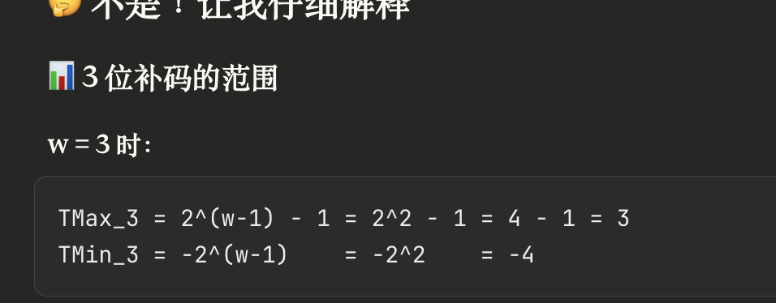
# 2.3 整数计算

## 2.3.1有无符号加法对比

### 无符号数加法
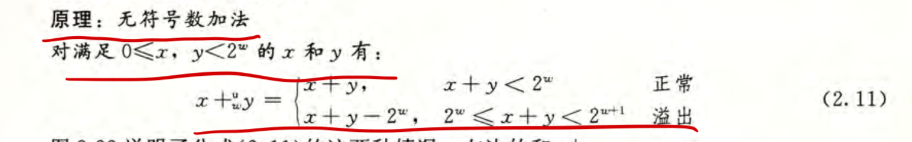

时刻记住补码最大值和无符号数最大值，2^w-1和2^w的区别
### 有符号数加法
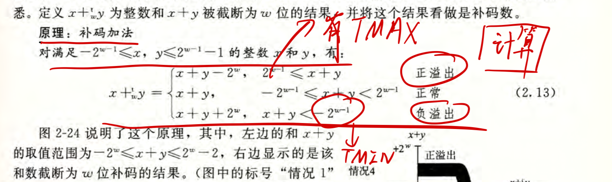
注意：判断使用TMax（补码最大值），就是2^w-1，然后等式前面用2^w=2^w-1+2^w-1.（关键：把x+y当整体看）
判断代码：
int tadd_ok(int x, int y) {
    int s = x + y;
    // 正溢出：x>0, y>0, s<0
    // 负溢出：x<0, y<0, s>=0
    int pos_overflow = (x > 0) && (y > 0) && (s < 0);
    int neg_overflow = (x < 0) && (y < 0) && (s >= 0);
    return !pos_overflow && !neg_overflow;
}
练习题：
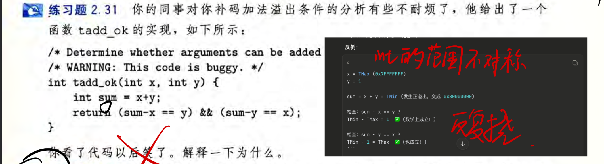
关注TMax和TMin取值范围的不对称（此时溢出，判断应该返回0，实际返回1，举反例方式解决）

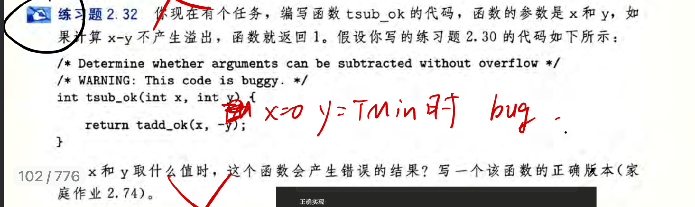

同样上面的问题，用-TMin和TMin的不同解决（关键）
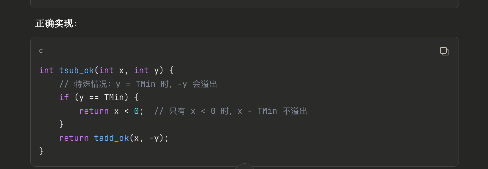

## 2.3.2有无符号数的逆元

无符号数逆元x'
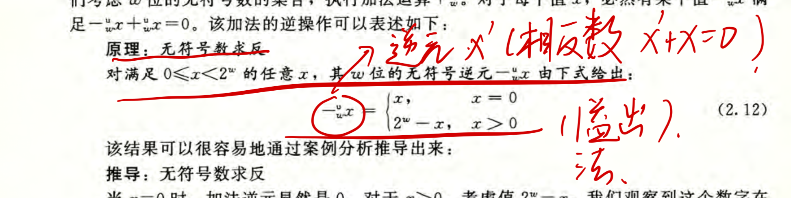
有符号数逆元
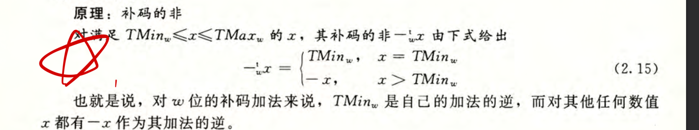
小tips：-TMin=TMax+1=TMin

## 2.3.4—2.3.5有无符号数的乘法

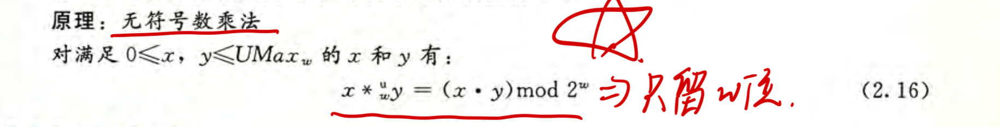
因为全部就w位（截断法，截断w位，就是**把高w位全部扔掉，只留低w位**，只留0，1到w-1，一共w位），和有符号数一样。
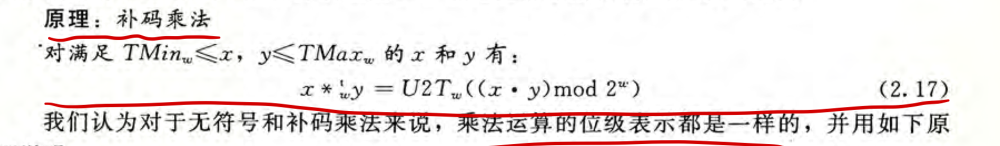

注意：
x，y如果位相同，相乘截断后的位数也是相同的。
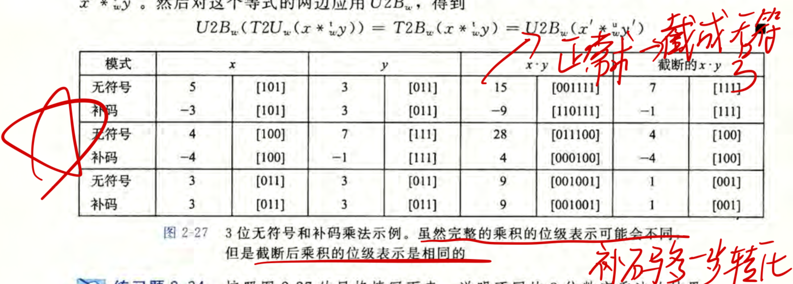
**两数之差是2^w的倍数，则低w位必然相同。** 而补码和无符号的乘积差值，恰好总是2^w的倍数。

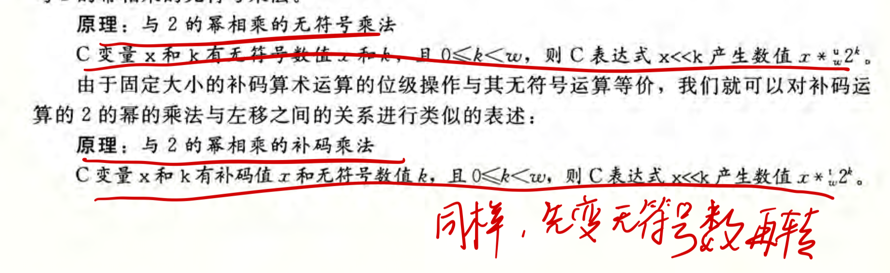

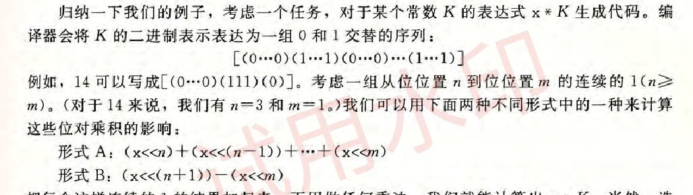
注意：
1.主要用B公式
2.w和n的区别（易混淆点）
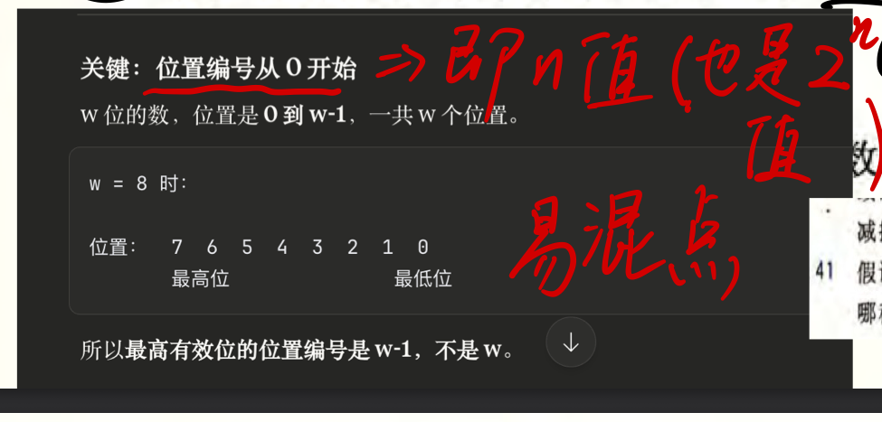

练习题：
K转化成2的表示
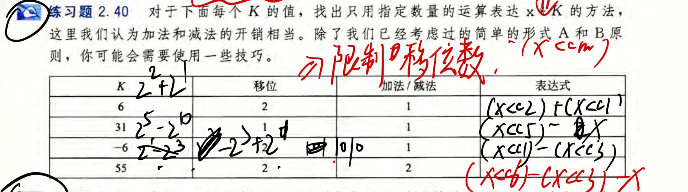

## 2.3.7有无符号数的除法

1.
除法的有舍入的说法：一般向0方向舍入
2.
无符号数的除法：
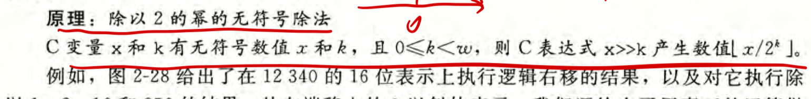
3.
有符号数的除法：

第一就是最高有效位是0：这个和无符号数的除法相同

第二是最高有效位为1，进行算数右移：
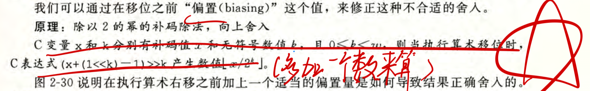
(1<<k)-1就是偏置值，更通俗就是：2^k -1的数值
（
右移k位 = 除以2^k 然后**向下取整（floor）**
我们想要的是**向零取整（truncate）**
对于负数，向下取整比向零取整**小1**（当有余数时）。
所以我们想：**有余数就+1补救，没余数就不动。**）
有余数：
低k位(≥1) + (2^k - 1) ≥ 2^k
无余数：
低k位(=0) + (2^k - 1) = 2^k - 1 < 2^k
）
4
练习题：
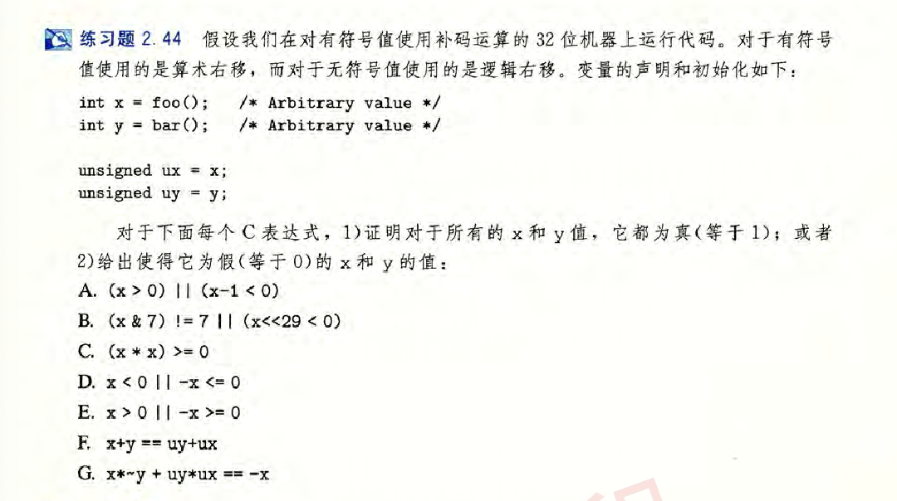
重点在B,F,G题
B：关注此时&表达含义

F题：
有符号和无符号位模式相同，加法截断后结果位模式也相同。+还有就是无符号数，有符号数比较，会有一方转化的

G题：
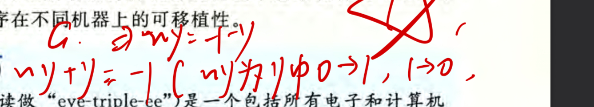

# 2.4浮点数
## 2.4.1二进制表示
简单，只是多加比如2^-1等等的计算
## 2.4.2IEEE浮点表示

浮点数表示：
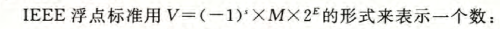
s：符号，s=1表示浮点数为负，s=0表示浮点数为正
M：尾数，有效数字部分
E：阶码，2的指数部分
（ps：类比120=1.2* 10^2的科学计数法）
k：浮点数整数部分位数
n：浮点数小数部分位数
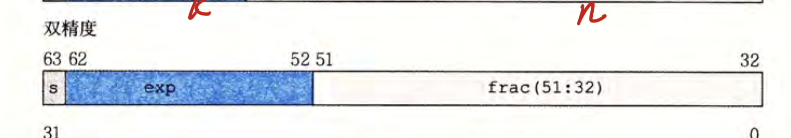
e：exp，表示整数部分二进制
f：frac，小数部分二进制
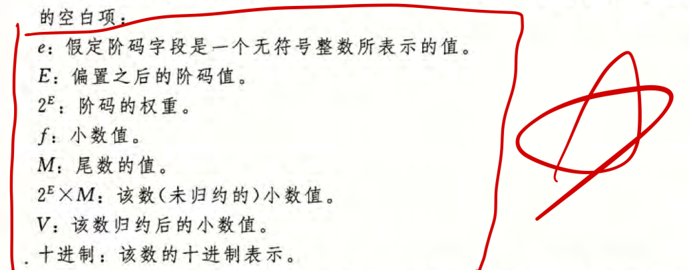

浮点数分类：
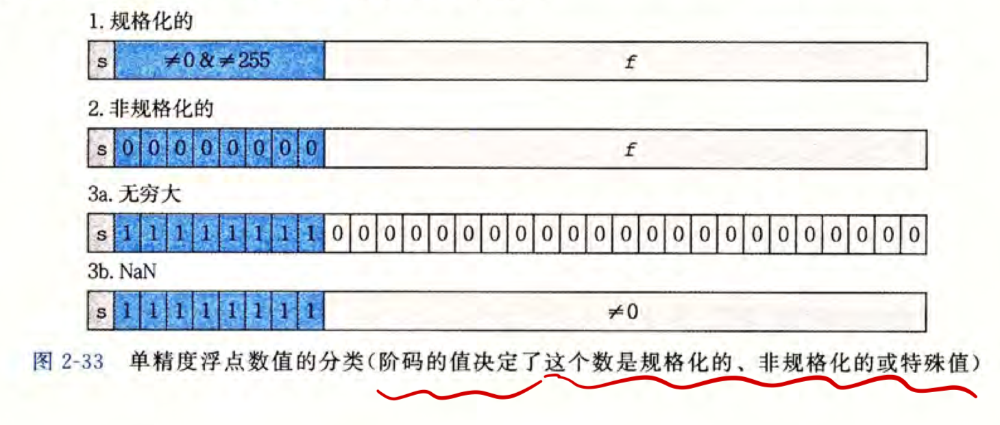

规格化值：
E=e-Bias，e：无符号整数值，Bias=2^k-1 -1，k=无符号整数位
M=1+f

非规格化的：
E=1-Bias
M=f

特殊值：
**无穷大**：frac全0，表示 +∞ 或 -∞，用来表示溢出的结果
**NaN**：frac不全0，表示"这不是一个合法的数"。
比如：
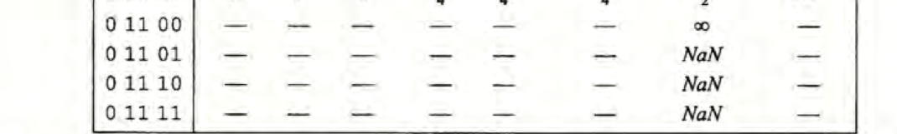

问题：
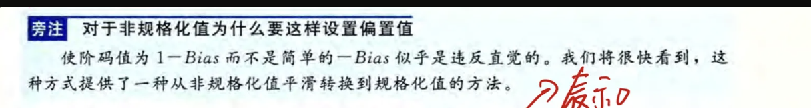
官方语句：**非规格化数和规格化数之间能够平滑过渡，相邻浮点数的间距保持一致，不会在边界处出现异常大的间隔。**
如果使用-Bias，会出现比如从0.11跳到0.25特别大的gap的情况

练习题：
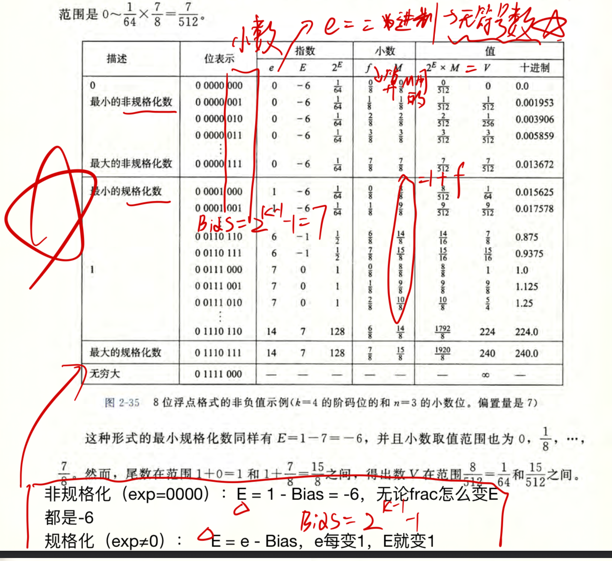

整数值转化成浮点数（上面的倒推）：
E：13
Bias：127（因为题目要求转化到单精度浮点数）
M：
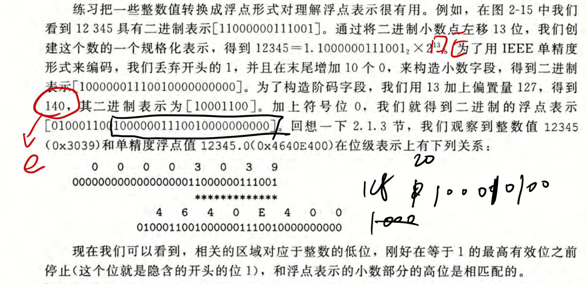

## 2.4.4舍入

向偶数舍入：向最近值舍入，1.4——>1，1.6——>2

应用在：
第一：二进制舍入
10.0001——>10.00
10.0010——>10.00（中间值，形如XXXYYYY100，Y是舍入值。舍入趋向最低位为0）

第二：整数舍入：
1.23501——>1.24
1.23500——>1.24（4是偶数）

向0舍入：向0的方向舍入

