# 3.2程序编码

### ✅ **必须搞懂的**

1. **gcc -S 命令怎么用？**
2. **AT&T 语法的基本规则是什么？**
3. **汇编代码的基本结构是什么？**（函数标签、指令、操作数）
4. **什么是机器代码？** 汇编和机器码的关系
5. **objdump -d 命令怎么用？**

### ⚠️ **可以暂时不懂的**

1. 为什么第一个参数在 `%rdi` 里？→ 3.7 节讲
2. `leaq` 指令的具体用法？→ 3.5 节讲
3. 机器码的编码规则？→ 选学内容
4. 各种指令后缀（`q`/`l`/`w`/`b`）的区别？→ 3.3 节讲.


## ✅ 你需要理解的核心

### **1. 什么是虚拟地址？**

- 程序用的地址（看起来是真实地址，其实是假的）
- 操作系统会把虚拟地址翻译成物理地址

### **2. 虚拟地址的好处？**

- **隔离**：不同程序互不干扰
- **安全**：程序无法访问别人的内存
- **灵活**：内存不够时，可以用硬盘补充

### **3. 程序员需要关心吗？**

- **写汇编/C 代码时：不用关心**
- 你看到的地址都是虚拟地址
- 操作系统会自动处理翻译

**关键：只有当程序真正访问虚拟地址时，才分配物理内存！**


## 3.2程序编码

gcc：GCC C编译器
-Og：生成清晰好理解的汇编代码

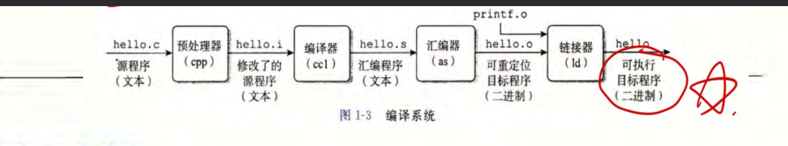
预处理：
输入：hello.c(源程序)
输出：hello.i(插入#include文件+#define指定宏)

编译器：
输入：hello.i
输出：hello.s（汇编代码）

汇编器：
输入：hello.s（汇编代码）
输出：hello.o（二进制目标代码文件）

链接器：
输入：printf.o（库函数文件）+hello.o（二进制目标代码文件）
输出：hello（可执行目标代码文件）

### 3.2.1机器级代码

ISA：说明书
定义处理器状态，指令格式以及指令对状态的影响

虚拟地址：程序员看到的“假“的内存地址
（操作系统会把虚拟地址翻译成物理地址）
特性：每个程序有独立的虚拟地址空间**


**汇编代码和二进制机械代码区别：

汇编代码，可读性高，是给人看的。
二进制代码是给 CPU 执行的。


可见处理器


**C 代码和机器代码的区别：

C语言有类型，机器代码不区分类型，都是字节
C 语言用变量，机器代码用寄存器和地址
C 语言的一行代码 = 多条机器指令


# 3.5算术和逻辑操作

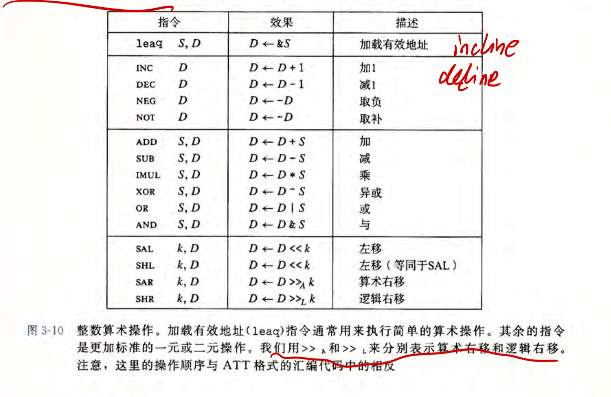


## 3.5.1加载有效地址
指令：leaq（movq的变形）
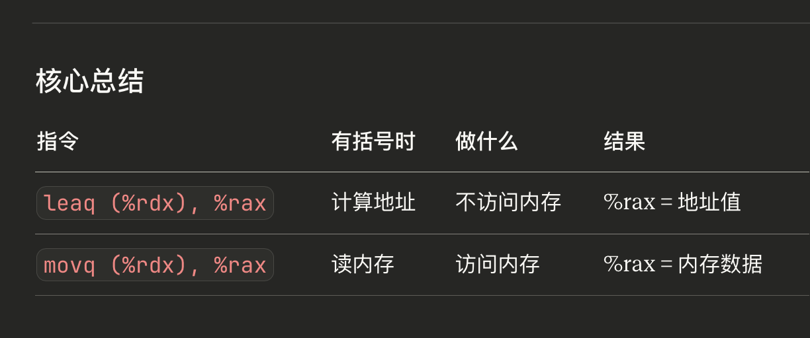
leaq 7(%rdx,%rdx,4), %rax
表示：
计算地址数值：7(%rdx,%rdx,4)（不访问内存！！！）
直接存到%rax
不访问内存

movq 7(%rdx,%rdx,4), %rax
表示：
计算地址数值：7(%rdx,%rdx,4)
读取内存地址！！！
将内存地址的数值存到%rax

练习：
✅ **在 leaq 里，立即数（0xA）和寄存器值都是普通数字**
比如
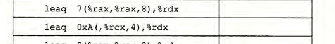
第二个答案是：10+4x

## 3.5.2一元和二元运算
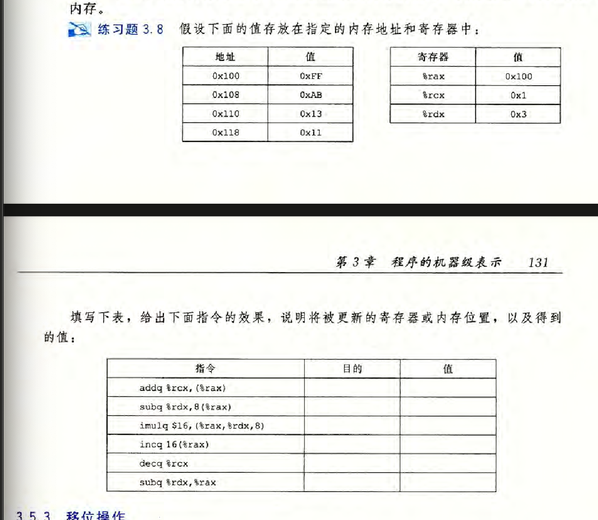
第一行：
##### 情况 1：目的是内存

assembly

```assembly
addq %rcx, (%rax)
```

**实际被修改的是**：

- ❌ 不是 `%rax` 寄存器（它的值 `0x100` 没变）
- ✅ 是内存地址 `0x100` 的内容（从 `0xFF` 变成 `0x100`）

**所以填**：`0x100`（内存地址）

---

##### 情况 2：目的是寄存器

assembly

```assembly
subq %rdx, %rax
```

**实际被修改的是**：

- ✅ `%rax` 寄存器本身（从 `0x100` 变成 `0xFD`）

**所以填**：`%rax`（寄存器名）


第二行：对比leaq，这个是内存引用，先计算8+%rax数值，再去内存找
（注意：8（%rax）是完整的内存地址，先计算再去找）


## 3.5.3 移位操作
知识：
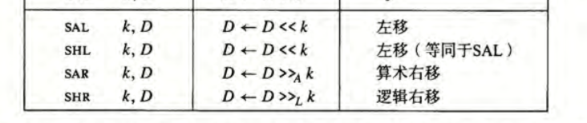
算术右移：有符号数
逻辑右移：无符号数
移位量k：数值只取立即数或者%cl（包括比如n或者其他寄存器）
原因：
因为移位量是 8 位，所以是取寄存器低 8 位，也就是比如 %ecx 或者 %rcx 的低 8 位或者 %cl 的低 8 位，因为 %cl 可以表示其他寄存器的一部分，最后就统一用 %cl 表示
（
更准确：
   1. ** 硬件只认 %cl**（8位寄存器）
2. **%cl 是 %ecx/%rcx 的低 8 位**
3. **通过 mov 把变量放到 %ecx/%rcx** 
4. **%cl 自动访问 %ecx/%rcx 的低 8 位** 
5. **所以移位指令写 %cl，实际读的是 %ecx/%rcx 的低 8 位**）

练习：
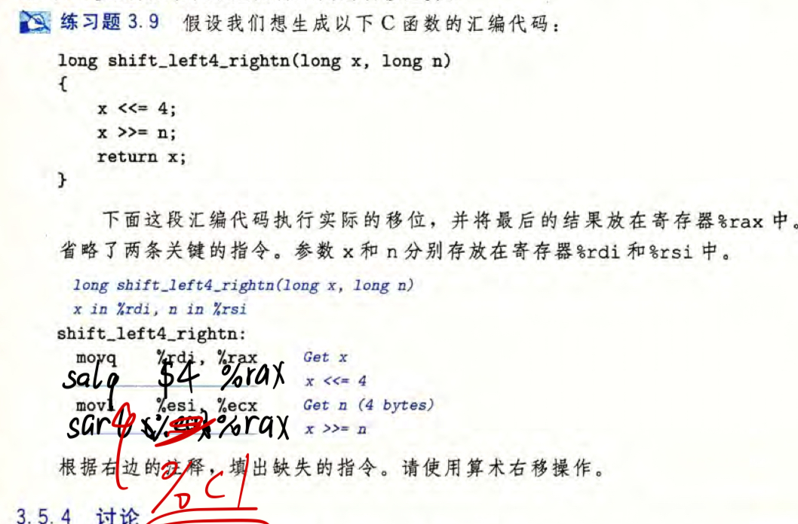

## 3.5.4讨论


练习：
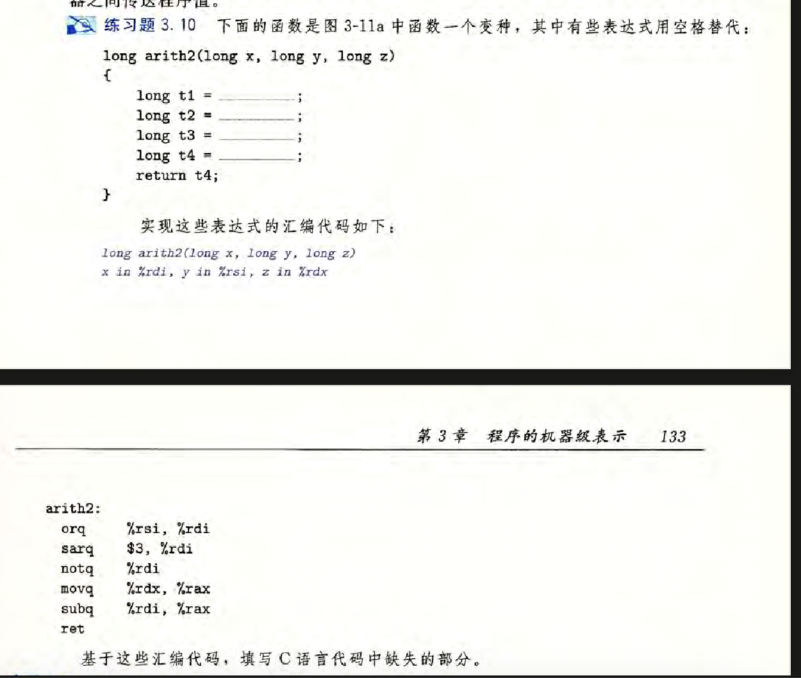
这个movq不能单独一行必须跟下面这行sub一起
重点：%rsi|%rdi是存在%rdi的，赋值给t1
答案：
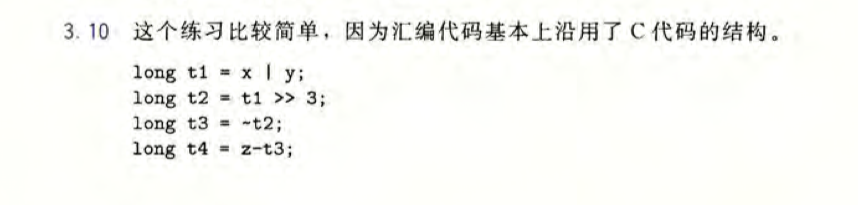


## 3.6控制

#### 前置条件：3.6.1条件码

**控制流（Control Flow）**：程序**执行的顺序/路径**

- 决定"下一步执行哪条指令"

**数据流（Data Flow）**：数据在程序中**如何移动和变化**

- 决定"变量的值如何改变"
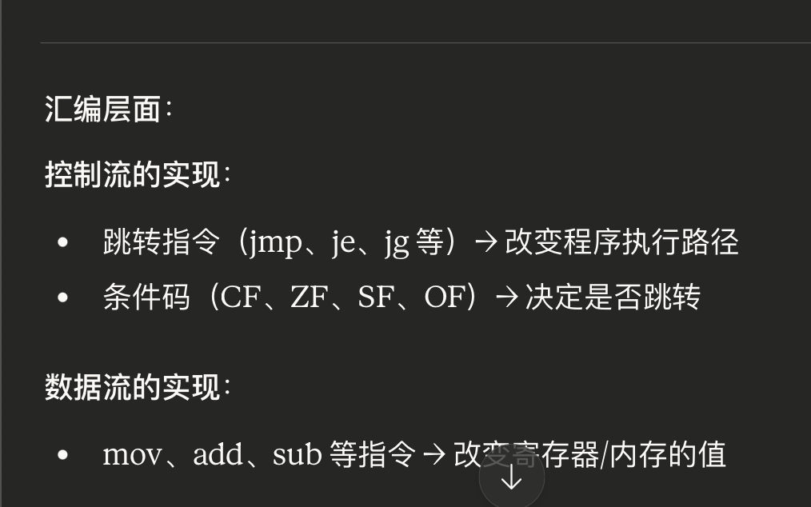

CF（Carry Flag）:无符号数判断是否溢出标志
ZF（Zero Flag）：判断是否为0
SF（Sign Flag）：判断符号
OF（OverFlow Flag）：有符号数溢出（正溢出和负溢出）
注意：0和1表示

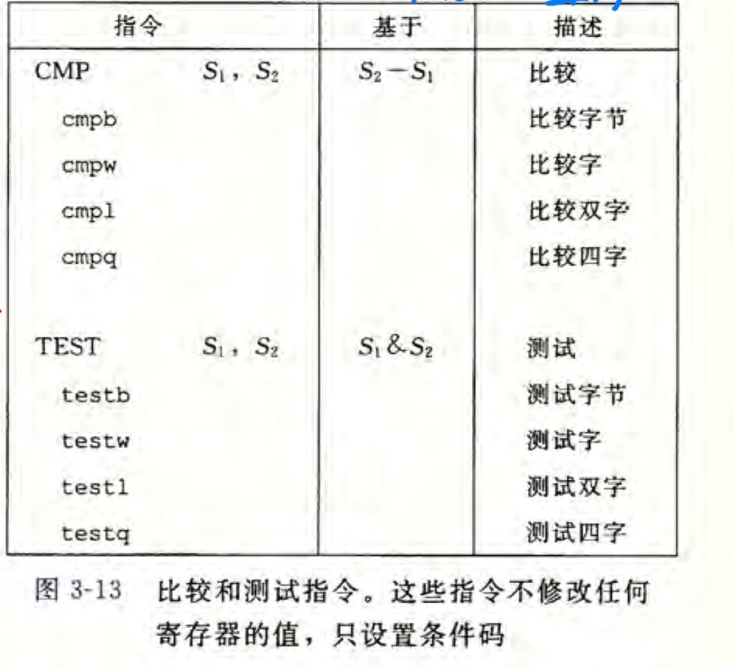
只设置条件码，不更新目的寄存器


### 条件码使用
#### 3.6.2设置字节根据条件码组合
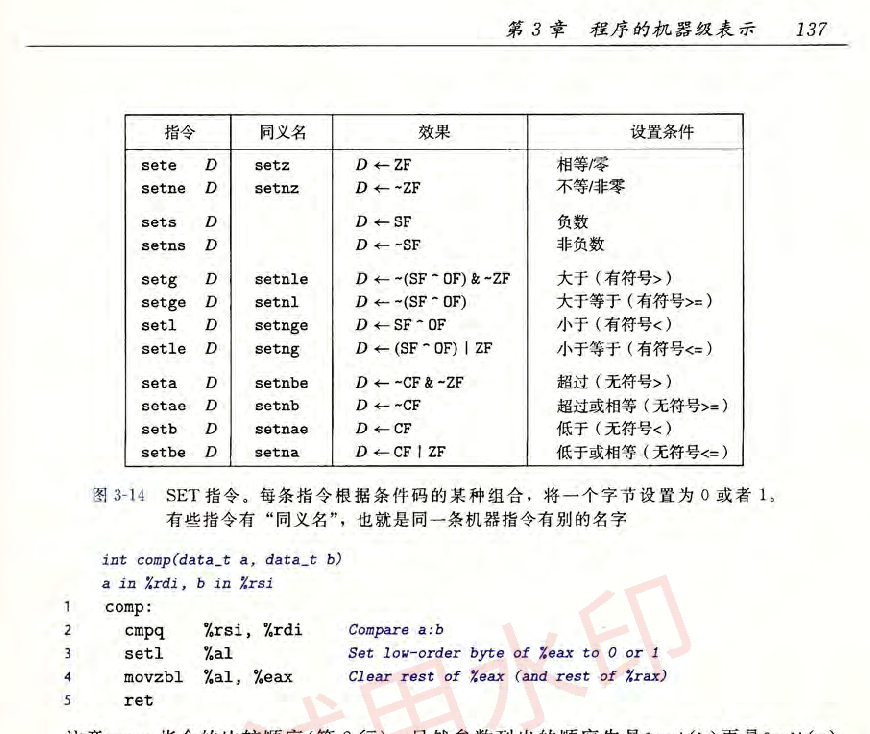
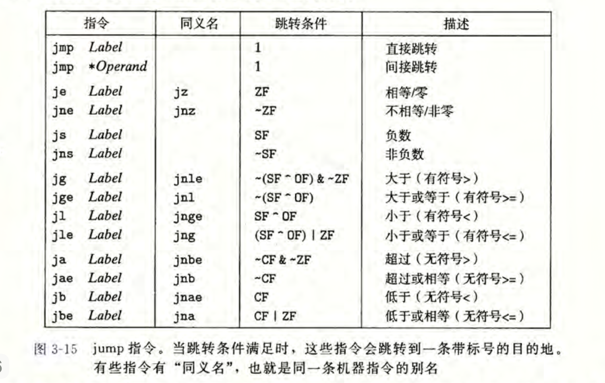

对比学习
**助记：**
先分2类：有符号数和无符号数（g l有符号数，a b无符号数）
接下来区分大于小于：
按顺序
g l，对应着大于小于
a b，对应着大于小于
接下来区分有没有=：
有e就多=，没e就没有=

**更改笔记：**
# 3.6 控制流

## 核心问题：C 语言的 if/while 在汇编层面如何实现？

### 关键机制：条件码 + 跳转指令

---

## 3.6.1 条件码

### 是什么？
4 个 1-bit 标志位：CF、ZF、SF、OF

### 为什么需要？
汇编没有"返回 true/false"的比较指令，只能通过"做运算 + 看标志位"判断

### 怎么设置？
- 自动设置：add/sub/imul 等算术指令
- 手动设置：CMP（比较）、TEST（测试）

### 记忆技巧
- CF = 无符号溢出（进位/借位）
- OF = 有符号溢出
- ZF = 结果为 0
- SF = 符号位（负数时为 1）

---

## 3.6.2 访问条件码

### 方式 1：SET 指令
根据条件码组合，设置字节为 0/1

**命名规律**：
- 有符号：setg（greater）、setl（less）
- 无符号：seta（above）、setb（below）
- 通用：sete（equal）、setne（not equal）

### 方式 2：跳转指令（下一节详细讲）

---

## 3.6.3 跳转指令

### 两种跳转
1. **无条件跳转**：jmp（直接跳）
2. **条件跳转**：je、jg、jl 等（根据条件码决定是否跳）

### 命名规律（同 SET 指令）
- jg = jump if greater（有符号大于）
- ja = jump if above（无符号大于）
- je = jump if equal（相等）

### 核心理解
**条件跳转 = CMP/TEST + 条件码检查 + 可能的跳转**

例子：
\`\`\`asm
cmpq %rbx, %rax    # 计算 %rax - %rbx，设置条件码
jg   .L1            # 如果 %rax > %rbx（有符号），跳转到 .L1
\`\`\`

对应 C 代码：
\`\`\`c
if (a > b) {
    // .L1 的代码
}
\`\`\`

---

## 总结：完整流程

1. **CMP/TEST** 设置条件码
2. 条件码组合反映"比较结果"
3. **跳转指令**根据条件码决定跳转
4. 实现 C 语言的条件控制流


## 3.6.4跳转指令编码

目标地址 = PC 当前值 + 偏移量
         = 下一条指令地址 + 偏移量


## 3.6.5用条件控制来实现条件分支
---

## 两种实现方式对比

### 左边：正常的 if-else（C 代码）

c

```c
if (x < y) {
    lt_cnt++;
    result = y - x;
} else {
    ge_cnt++;
    result = x - y;
}
```

### 右边：用 goto 改写（模拟汇编逻辑）

c

```c
if (x >= y)
    goto x_ge_y;   // 条件跳转
lt_cnt++;
result = y - x;
return result;

x_ge_y:           // 标签
ge_cnt++;
result = x - y;
return result;
```


````assembly
testq %rax, %rax
```

**执行**：
```
%rax & %rax → 不保存结果，只更新标志位
````

---

## 常见用法

### 检查寄存器是否为 0

assembly

```assembly
testq %rax, %rax
jg    .L3          ; 如果 %rax > 0，跳转
```

**逻辑**：

- `%rax & %rax` = `%rax`
- 如果结果是 0 → 设置零标志位（ZF = 1）
- 如果结果不是 0 → 清除零标志位（ZF = 0）

# 3.6.6 用条件传送来实现条件分支
---

## 条件传送相对传统跳转为什么更快？

### 传统跳转的问题

- CPU 需要预测跳转方向
- 预测错误会导致流水线清空，浪费时间

### 条件传送的优势

- **没有跳转**，指令顺序执行
- CPU 流水线不会被打断
- 即使计算了两个分支，总体仍然更快

### 性能分析
##### 完整逻辑链 ``` 
1. CPU 用流水线并行执行多条指令 ↓ 
2. 遇到条件跳转时，必须预测跳转方向 ↓
3. absdiff 的条件无法预测（50% 准确率） ↓ 
4. 预测错误 → 清空流水线 → 浪费 15~30 周期 ↓ 
5. 条件跳转平均 19 周期 ↓ 
6. 条件传送可避免跳转，只需 8 周期 ，即使计算两个分支，仍然更快↓ 
## 条件传送
#### 条件传送指令的基本语法

#### 条件传送指令的使用

**条件跳转和条件传递都是"根据条件码决定"，但决定的事情不同**：

|指令类型|检查条件码|决定什么|是否影响流水线|
|---|---|---|---|
|条件跳转（jge）|✓|是否跳转|是（可能清空）|
|条件传送（cmovge）|✓|是否传送数据|否（顺序执行）|
