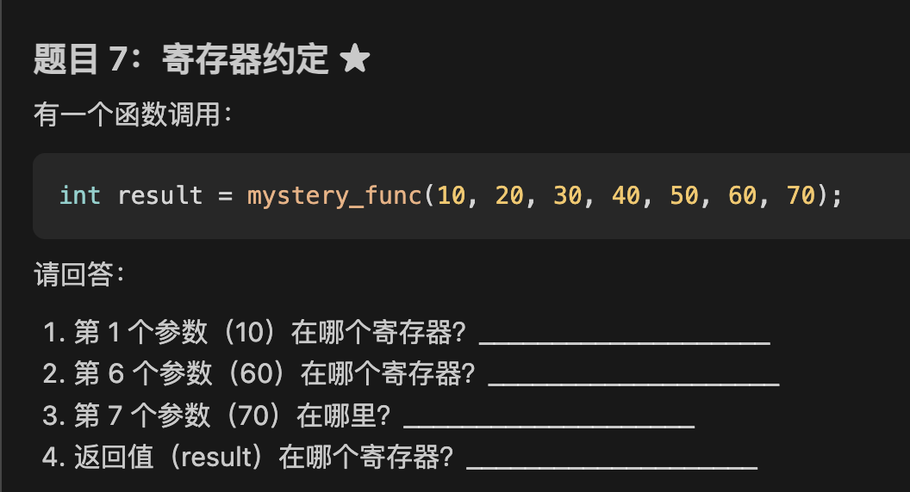
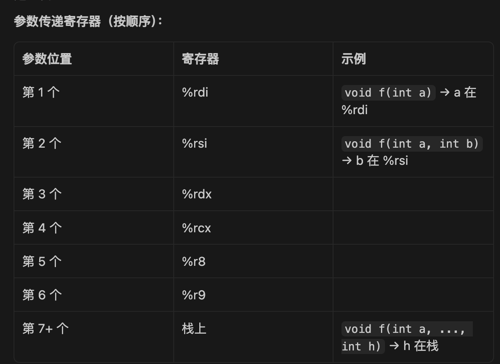
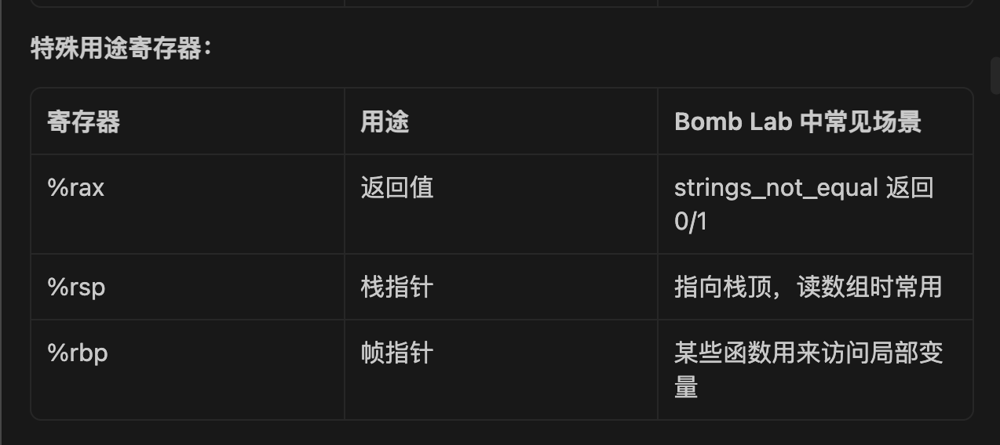
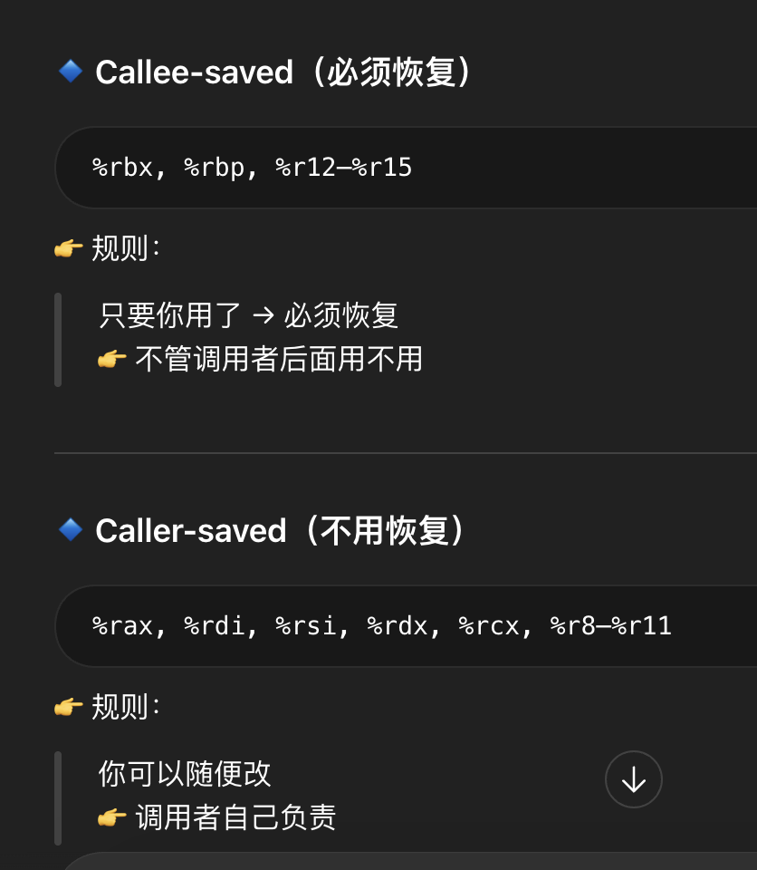
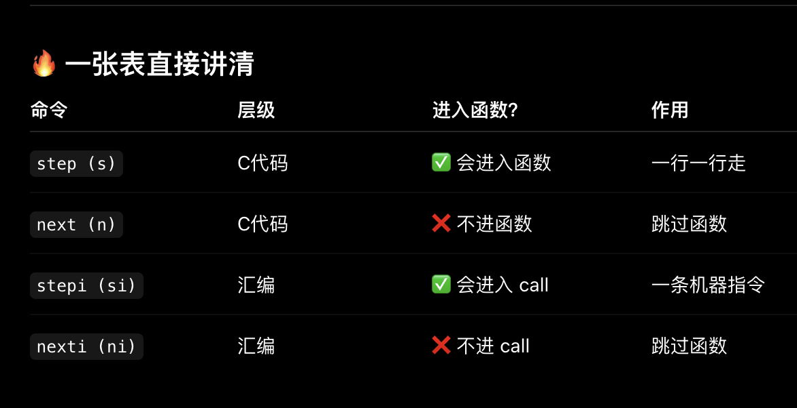

### 前置知识：

问题：
|   |   |   |
|---|---|---|
|`continue` 或 `c`|继续执行到下一个断点|跳过已解决的 phase|
啥意思？？？

2
6. 程序输出欢迎信息，等你输入

7. 输入你猜的字符串（比如 "hello"）

8. 程序停在 phase_1 入口（因为有断点）

9. 单步执行汇编: stepi（简写 si）

10. 继续运行: continue（简写 c）

11. 想退出: quit

```
到这里看不懂了


3

4
  

**Bomb Lab 中什么时候用：**

- 在每个 phase_X 函数入口设断点

- 在可疑的 call 指令前设断点（比如 strings_not_equal）

- 在 explode_bomb 前设断点（防止不小心炸了）
  
  这个是什么意思？？？
  
  5
    

**Bomb Lab 中什么时候用：**

- 在每个 phase_X 函数入口设断点

- 在可疑的 call 指令前设断点（比如 strings_not_equal）

- 在 explode_bomb 前设断点（防止不小心炸了）
  什么意思？？？
  
  6

**易错点：**

- ❌ 看整数数组用 `x/s`，显示乱码
    
- ❌ 看跳转表用 `x/8wd`，应该用 `x/8xg`（地址是 8 字节）
    
- ❌ 忘了数量，只写 `x/xg 地址`，只看一个
  啥意思，举例一下
  
  7
  ```
explode_bomb
```

这个什么意思

### 5. 查看调用栈

**是什么：** 函数调用会在栈上留下痕迹，backtrace 可以看到调用链。

**Bomb Lab 中什么时候用：**

- 确认当前在哪个 phase
    
- 看 explode_bomb 是从哪里调用的
    
- 递归函数（phase_4）要看递归深度
    

**过程思维：**

```
你不小心触发了 explode_bomb:
  1. GDB 停在某处
  2. 查看调用栈: backtrace
     输出:
     #0  explode_bomb () at bomb.c:42
     #1  0x0000000000400f0a in phase_3 () at bomb.c:78
     #2  0x0000000000400e2d in main () at bomb.c:96
  3. 看到是 phase_3 调用的
  4. 切换到 phase_3 的栈帧: frame 1
  5. 查看 phase_3 的局部变量
```

**速查表：**

|   |   |   |
|---|---|---|
|命令|简写|作用|
|`backtrace`|`bt`|显示调用栈|
|`frame 编号`|`f 1`|切换到指定栈帧|
|`up`|-|切换到上一层（调用者）|
|`down`|-|切换到下一层（被调用者）|
|`info frame`|-|查看当前栈帧详细信息|

**易错点：**

- ❌ 看到很多层栈帧慌了，其实只需要关注 phase_X 和 main
    
- ❌ 递归函数的栈帧看起来一样，要仔细看参数值
- 看不懂这一块讲什么


问题
1
---

# ④ `explode_bomb` 是什么？

这个很关键：

👉 **这是炸弹函数**

只要调用它：

💥 BOOM（程序结束）

---

### 你输入错了：

call explode_bomb

👉 游戏结束

---

### 为什么要在它前面打断点？

👉 防止你真的炸：

break explode_bomb

这样：

👉 程序一要炸就停住  
👉 你还能分析
再讲一下
## 易错点：
1
**

寄存器里本质是数字  
如果用 `(寄存器)`，就是把这个数字当地址，从内存取值  
`lea` 是计算地址（不访问内存）  
`mov` 是否访问内存，取决于有没有 `()`

**1.lea  (%rsp), %rax 和 mov %rsp, %rax 同样是寄存器的数值——>寄存器数值，同样是赋值，到底有什么区别？

解答：

lea定义上意思是能够只是计算寄存器的数值，不访问内存。

因此相比于mov，它还可以做复杂运算，

比如：lea 0x8(%rsp), %rax，在一行里面解决。

而mov %rax, %rcx        ; 复制
mov (%rax), %rcx      ; 从内存读
mov %rax, (%rbx)      ; 写内存
mov只允许进行赋值，不允许运算。

**2.mov %rsp, %rax和mov (%rsp),%rax区别：

寄存器里本质是数字 。`(寄存器)`，就是把这个数字当地址，从内存取值。而`寄存器`就是直接使用这个数字进行运算。

**3.
|寄存器|本质作用|特点|
|---|---|---|
|`%rax`|存返回值|临时|
|`%rsp`|栈顶位置|一直变|
|`%rbp`|当前函数基准|稳定|

%rsp和%rbp区别就是在于指向栈位置是否固定

**4.


**关键：
1
> 前 6 个参数通过寄存器传递，第 7 个及之后的参数通过栈（内存）传递！！！！
> 
> 参数可能来自寄存器或栈（内存），但CPU会把它们加载到寄存器中进行运算
> 2
> 栈是内存的一个区域
> 3
> 
> 上面寄存器比如%r9主要用来传递参数（大多是这样）
> 👉 **是的，`%rsp / %rbp` 主要是用来“定位和访问”栈里的数据**  
👉 ❌ **它们不是用来“传递参数”的寄存器**


**5.
关于栈的结构：

高地址
│
│ 参数（栈上传的）
│ 返回地址
│ 旧 rbp        ← rbp
│ 局部变量
│ 局部变量      ← rsp
│
低地址

`%rsp` 指向的是这一整块空间的“起点”

sub $0x20, %rsp 指的是在栈上开了 32 字节空间，同样也代表着这部分区域是局部变量区域。

之后要表示局部变量的方法是：
使用”起点“+偏移量的方法表示

mov -0x4(%rbp), %eax   ; 变量1
mov -0x8(%rbp), %ebx   ; 变量2
mov -0xc(%rbp), %ecx   ; 变量3

**6.
👉 **调用者（caller）**：发起函数调用的函数  
👉 **被调用者（callee）**：被调用去执行的函数


**✅ Callee-saved（必须恢复）

%rbx  
%rbp  
%r12  
%r13  
%r14  
%r15

---

**❗ Caller-saved（随便用）

%rax  
%rdi  
%rsi  
%rdx  
%rcx  
%r8  
%r9  
%r10  
%r11




## 知识
**`step / next / stepi / nexti` 区别




**改进：
1
使用❌ 错误
（原因）
✅ 正确
当成用Mac写题目的笔记


问题：
1


2

这是什么意思
```asm
mov    0x8(%rsp),%edx   ; 从内存读取
```
这个是赋值还是什么？？？


```asm
lea    0x8(%rsp),%rax   ; %rax = 地址本身
mov    0x8(%rsp),%rax   ; %rax = 地址处的值
```asm
mov    %rdi,%rbx        ; 寄存器复制
```
这些的区别是什么？？？

mov    %rdi,%rbx        ; 寄存器复制和lea    0x8(%rsp),%rax   ; %rax = 地址本身不是一样？？？


```

3
**速查表：**

|   |   |   |   |
|---|---|---|---|
|指令|AT&T 语法|作用|条件码|
|mov|`mov S, D`|D = S|不变|
|lea|`lea 地址, D`|D = 地址（不访问内存）|不变|
|add|`add S, D`|D += S|改变|
|sub|`sub S, D`|D -= S|改变|
|imul|`imul S, D`|D *= S（有符号）|改变|
|and|`and S, D`|D &= S|改变|
|or|`or S, D`|D \|= S|改变|
|xor|`xor S, D`|D ^= S|改变|
|shl|`shl $k, D`|D <<= k|改变|
|shr|`shr $k, D`|D >>= k（逻辑右移）|改变|
|sar|`sar $k, D`|D >>= k（算术右移）|改变|
|cmp|`cmp S2, S1`|计算 S1 - S2，只设置条件码|改变|
|test|`test S1, S2`|计算 S1 & S2，只设置条件码|改变|

这些我已经快忘光光了，后面要记得复习，特别是条件码

4
```

执行 call 0x401338:
  1. 计算返回地址: 0x400ee9 + 5 = 0x400eee（call 指令长度为 5）
  2. push 返回地址到栈:
     %rsp -= 8
     M[%rsp] = 0x400eee
  3. 跳转到 0x401338:
     %rip = 0x401338
```
这个是干嘛的


5
### 11. 数组和结构体的汇编表示

**是什么：** 数组和结构体在内存中连续存储，用基址+偏移访问。

**Bomb Lab 中什么时候用：**

- phase_2 读 6 个数（数组）
    
- phase_6 操作链表（结构体指针）
    

**过程思维：**

**示例 1: 数组访问**

```c
int arr[6] = {1, 2, 4, 8, 16, 32};
int x = arr[3];
```

**汇编代码：**

```asm
; 假设 arr 的地址在 %rsp
lea    (%rsp),%rax        ; %rax = arr 的地址
mov    0xc(%rax),%edx     ; %edx = arr[3]
```

**CPU 执行过程：**

```
内存布局（假设 %rsp = 0x7fffffffe000）:
  0x7fffffffe000: 1  (arr[0])
  0x7fffffffe004: 2  (arr[1])
  0x7fffffffe008: 4  (arr[2])
  0x7fffffffe00c: 8  (arr[3])  ← 要访问的
  0x7fffffffe010: 16 (arr[4])
  0x7fffffffe014: 32 (arr[5])

执行 lea (%rsp),%rax:
  %rax = 0x7fffffffe000

执行 mov 0xc(%rax),%edx:
  1. 计算地址: 0x7fffffffe000 + 0xc = 0x7fffffffe00c
  2. 从该地址读取 4 字节: 8
  3. %edx = 8
```

**通用公式：**

```
arr[i] 的地址 = arr 的基址 + i * sizeof(元素)
```

**示例 2: 结构体访问**

```c
struct node {
    int data;     // 偏移 0
    struct node* next;  // 偏移 8
};

node->data
node->next
```

**汇编代码：**

```asm
; 假设 node 指针在 %rdi
mov    (%rdi),%eax        ; %eax = node->data
mov    0x8(%rdi),%rdi     ; %rdi = node->next
```

**CPU 执行过程：**

```
内存布局（假设 %rdi = 0x603000）:
  0x603000: 5        (data 字段，4 字节)
  0x603004: (padding, 4 字节对齐)
  0x603008: 0x603010 (next 字段，8 字节指针)

执行 mov (%rdi),%eax:
  1. 从 0x603000 读取 4 字节
  2. %eax = 5

执行 mov 0x8(%rdi),%rdi:
  1. 计算地址: 0x603000 + 8 = 0x603008
  2. 从该地址读取 8 字节: 0x603010
  3. %rdi = 0x603010 (下一个节点的地址)
```

**速查表：**

**数组索引计算：**

|   |   |   |
|---|---|---|
|数组类型|元素大小|汇编示例（访问 arr[3]）|
|`int arr[]`|4 字节|`mov 0xc(%rax),%edx`（0xc = 3*4）|
|`long arr[]`|8 字节|`mov 0x18(%rax),%rdx`（0x18 = 3*8）|
|`char arr[]`|1 字节|`movzbl 0x3(%rax),%edx`|

**结构体字段偏移：**

```c
struct example {
    int a;      // 偏移 0
    char b;     // 偏移 4
    long c;     // 偏移 8（对齐）
    int* d;     // 偏移 16
};
```

**易错点：**

- ❌ 忘了数组索引要乘以元素大小（`arr[3]` 不是偏移 3，而是偏移 12）
    
- ❌ 结构体字段有对齐，偏移可能不连续
    
- ❌ 指针的指针要解引用两次

这部分忘记了，要回看。

6
跳转表也有点忘记了

7
### 题目 9：条件跳转 ★★

**标准答案：**

1. ZF = **0**，SF = **1**
    
2. jg .L2 会跳转吗？**不会**
    
3. 炸弹会爆炸吗？**会**
    

**解析：**

**执行 `cmp $0x5,%eax`（%eax = 4）：**

```
计算: 4 - 5 = -1

设置条件码:
  ZF (Zero Flag) = 0 (结果不为 0)
  SF (Sign Flag) = 1 (结果为负)
  CF (Carry Flag) = 1 (无符号减法有借位)
  OF (Overflow Flag) = 0 (有符号减法无溢出)
```
复习一下，每一个条件码之间的区别


**objdump -d bomb | tee asm.txt。">"重定向
